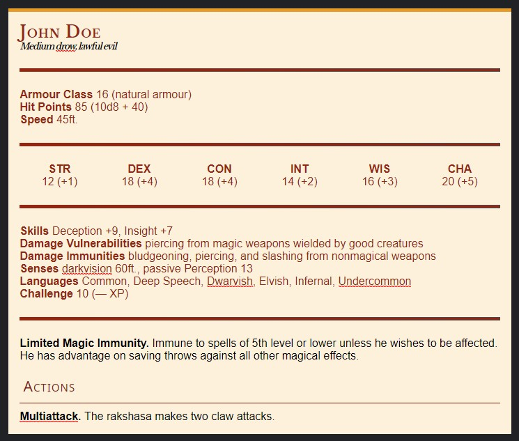

# D&amp;D Monster Stat Block MarkDown for Typora

This repository contains a file `base.user.css` that when its contents are added to your own Typora `base.user.css`, you will be able to create a D&D stat block in no matter what theme you're using. In order for this to work, you have be ok with losing your `blockquote` as it will turn all `blockquote`s into monster stat blocks. There is are a couple of specialized markdown patterns that are used to generate the specific sections, some of which ordering matters.


## How to Install
1. Launch your [Typora](https://typora.io/) program 
2. Go to File > Preferences > Appearance
3. Click the "Open Theme Folder" button

This will open an explorer window where you will find a file called `base.user.css`. Simply open the file in any text editor, and copy the contents of this repository's [`base.user.css`](https://github.com/flamewave000/dnd-monster-md/blob/master/base.user.css) file, and paste it at the bottom of your local file.

Now all you have to do is save the file, and relaunch Typora.

## How To Use

Below is an example of a monster stat block:

```markdown
> # John Doe
>
> ### Medium drow, lawful evil
>
> ---
>
> > 1. 16 (natural armour)
> > 1. 85 (10d8 + 40)
> > 1. 45ft.
>
> ---
>
> > |||||||
> > | ------------ | ---- | ---- | ---- | ---- | ---- |
> > |12 (+1)|18 (+4)|18 (+4)|14 (+2)|16 (+3)|20 (+5)|
>
> ---
>
> > - Deception +9, Insight +7
> > - piercing from magic weapons wielded by good creatures
> > - bludgeoning, piercing, and slashing from nonmagical weapons
> > - darkvision 60ft., passive Perception 13
> > - Common, Deep Speech, Dwarvish, Elvish, Infernal, Undercommon
> > - 10 (— XP)
>
> ---
>
> **Limited Magic Immunity.** Immune to spells of 5th level or lower unless he wishes to be affected. He has advantage on saving throws against all other magical effects.
>
> ## Actions
>
> **Multiattack.** The rakshasa makes two claw attacks.
>
```

Which will produce the following within Typora



|Component|Mark Down|
|-:|:--|
|Monster Name|Header 1: `#`|
|Monster Size/Type/Alignment|Header 3: `###`|
|Stat Block Separators|Horizontal Rule: `---`|
|Monster Attributes (armour. HP, etc)|Ordered List within a Blockquote:<br />`> 1. <armour class>`<br />`> 1. <hit points>`<br />`> 1. <speed>`<br />These rows will automatically have the "Armour Class", "Hit Points", "Speed" titles added to each row in that order.|
|Monster Stats|6 column Table within a Blockquote:<br />`> |||||||`<br />`> |-|-|-|-|-|-|`<br />`> |<str>|<dex>|<con>|<int>|<wis>|<cha>|`|
|Monster Properties|6 row Unordered List within a Blockquote: `> - content`<br />These rows will automatically be prefixed by a specific category, such as 'skill' or 'languages'.|
|Monster Info|This section is just regular Mark Down, nothing special|
|Monster Info Headers|In this example, I have a header for "Actions"<br />Header 2: `##`|


If you need to add/remove/reorder additional Monster Attributes, or Monster Properties, these can be found at the top of the CSS, and are as follows:

```css
/* Attributes */
blockquote blockquote ol li:nth-child(1)::before {content: "Armour Class";}
blockquote blockquote ol li:nth-child(2)::before {content: "Hit Points";}
blockquote blockquote ol li:nth-child(3)::before {content: "Speed";}
/* Stats */
blockquote blockquote table td:nth-child(1)::before {content: "STR";}
blockquote blockquote table td:nth-child(2)::before {content: "DEX";}
blockquote blockquote table td:nth-child(3)::before {content: "CON";}
blockquote blockquote table td:nth-child(4)::before {content: "INT";}
blockquote blockquote table td:nth-child(5)::before {content: "WIS";}
blockquote blockquote table td:nth-child(6)::before {content: "CHA";}
/* Properties */
blockquote blockquote ul li:nth-child(1)::before {content: "Skills";}
blockquote blockquote ul li:nth-child(2)::before {content: "Damage Vulnerabilities ";}
blockquote blockquote ul li:nth-child(3)::before {content: "Damage Immunities";}
blockquote blockquote ul li:nth-child(4)::before {content: "Senses";}
blockquote blockquote ul li:nth-child(5)::before {content: "Languages";}
blockquote blockquote ul li:nth-child(6)::before {content: "Challenge";}
```

You will notice that the `nth-child(#)` portion defines the ordering of the rows, and the content within the quotes (`"text to show "`) is what will be displayed. You can change this to any text you want.

As an example, you can add a 4th row for "Proficiency Bonus" in the monster's attributes using the following:

```css
blockquote blockquote ol li:nth-child(4)::before {content: "Proficiency Bonus";}
```

